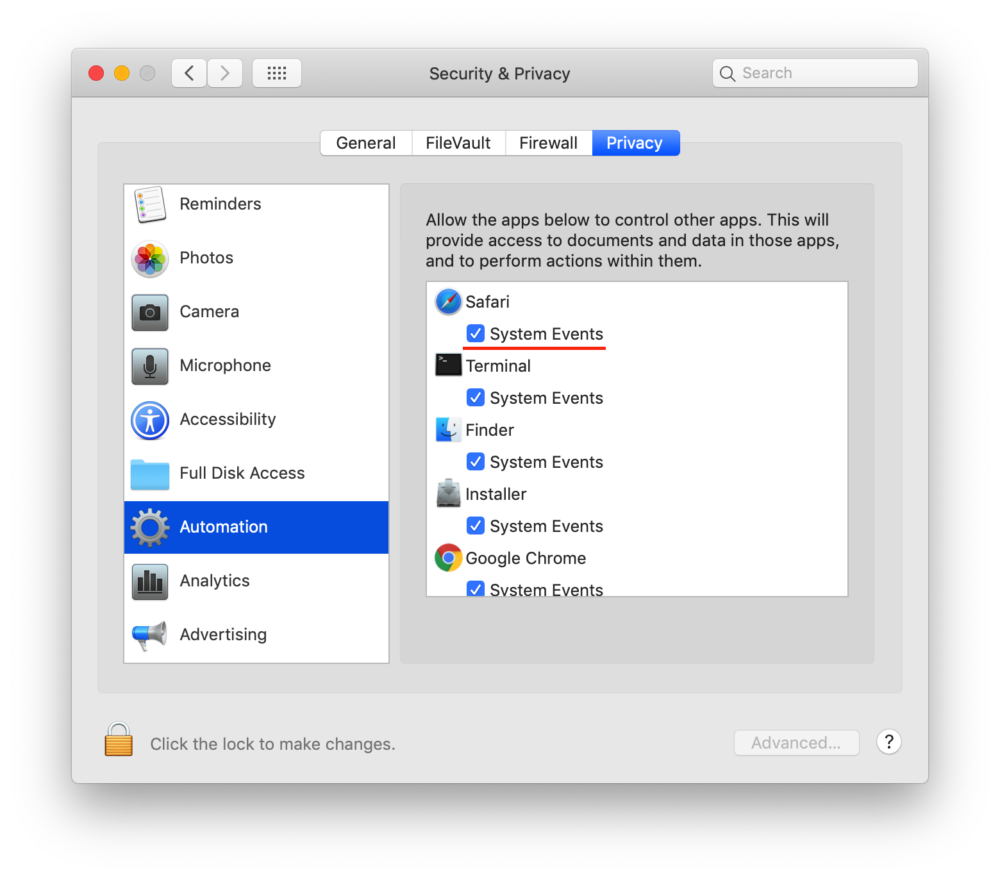

# Copy-to-CotEditor

[](README-zh.md)

[English](README.md) | [中文](README-zh.md)

## 介绍
当你在浏览器或其他位置需要做一些记录时，**Copy-to-CotEditor** 可以帮助你快速地记录文本，免去了打开文本编辑器并进行复制粘贴的操作，利用 *applescript* 实现了快速自动化的文本记录。
## 使用
在浏览器或其他位置选择需要记录的内容，再使用快捷键进行 *Fast-Copy*，在 CotEditor 中就可以得到你需要记录的内容（默认是纯文本形式，如需记录样式需在 CotEditor 中另行设置）
## 安装
* 将 git 仓库克隆到本地， 运行目录中的 Copy to CotEditor

```sh
git clone https://github.com/BoolMark/Copy-to-CotEditor.git
```
* 安装完成后，打开键盘偏好设置，为 Copy to CotEditor 设置一个快捷键


* 在设置快捷键之后需要注意的一点就是，你需要开启浏览器或其他程序的自动化控制权限（System Events），一般情况下应用程序会自动请求访问权限。


* 再将应用程序添加到 **辅助功能** 的列表中，这一步如果应用程序没有请求作为辅助功能的权限就需要你点击 “+” 手动添加。


#### * 接下来你就可以使用快捷键进行文本的快速记录了！
