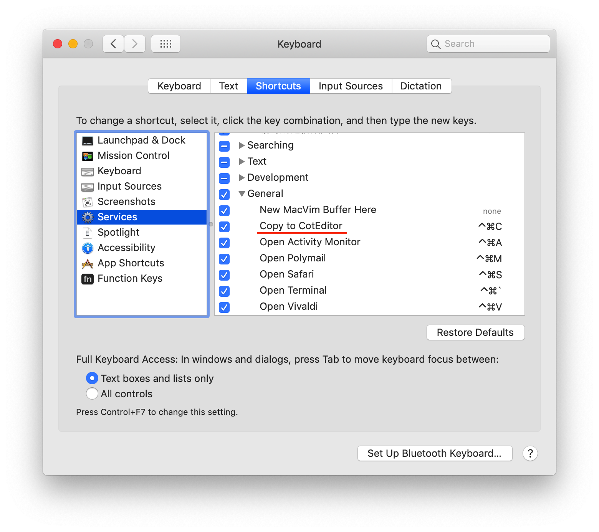
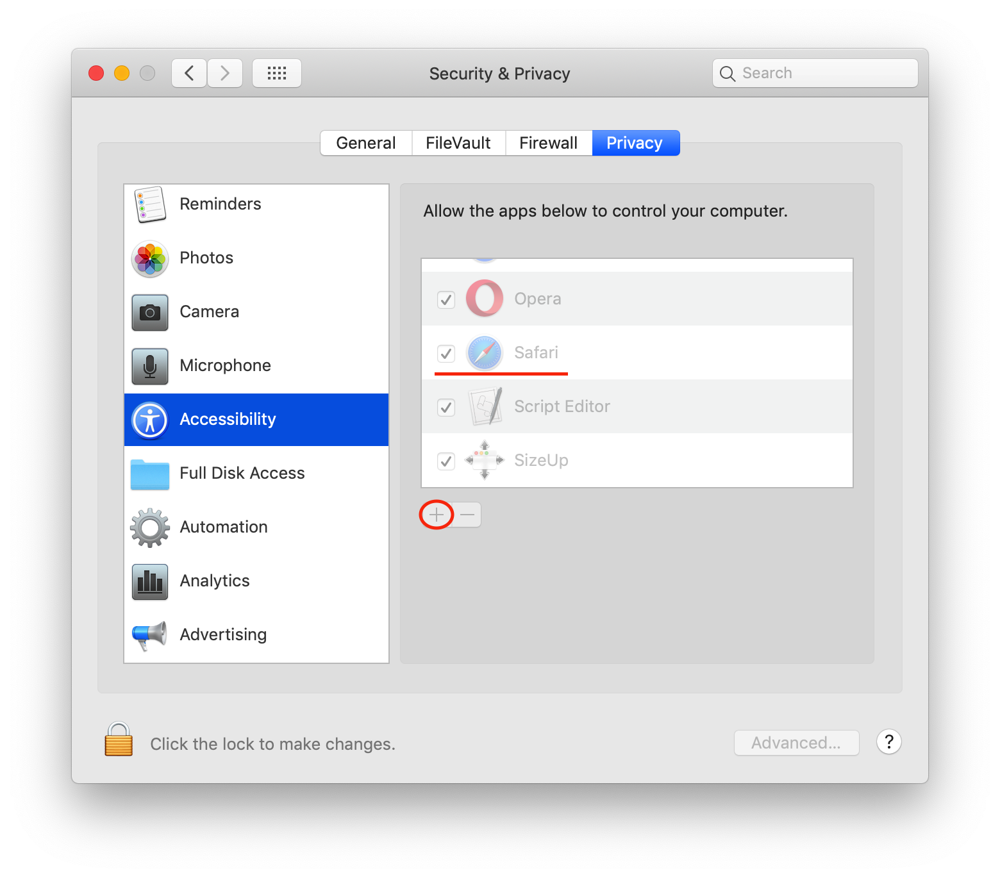

# Copy-to-CotEditor

[](README-zh.md)

[English](README.md) | [中文](README-zh.md)

## Introduction

**Copy-to-coteditor** can help you quickly record text when you need to do so in a browser or elsewhere, eliminating the need to open a text editor to Copy and paste, it can be quickly automating text recording with ***applescript***.

## How to Use?

You can select the content which you want to record in the browser or other places, and then use the shortcut key ***fast-copy*** to get the content you want to record in **CotEditor** (the default is plain text, the recording style needs to be set separately in CotEditor).

## Installation

Clone and run the Copy-to-CotEditor/Copy to CotEditor

```sh
git clone https://github.com/BoolMark/Copy-to-CotEditor.git
```

* After the installation, open the *keyboard shortcuts* and set a shortcut key for **Copy-to-CotEditor**.


* One thing yout need to note after setting up the shortcut is that you need to enable the *System Events* for your browser or other applications, which typically request access automatically.


* Then add the application to the list of **Accessibility**. This step requires to click **"+"** to add the application manually if the application does not request permissions for the Accessibility.


### * Then you can use the shortcut key to make a quick record of the text ! ^_^
